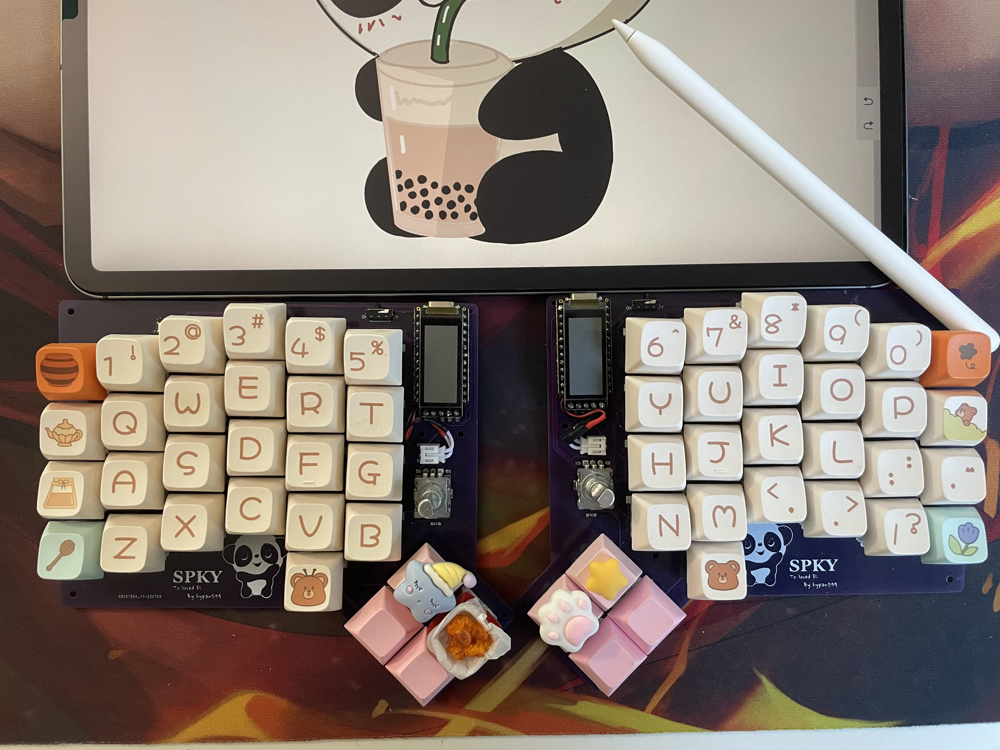
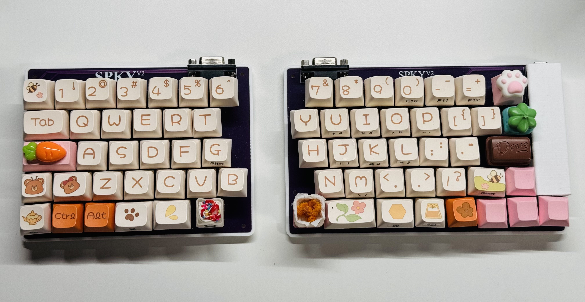
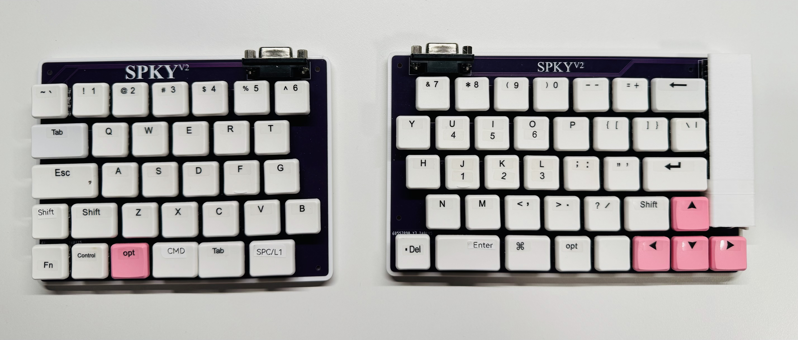
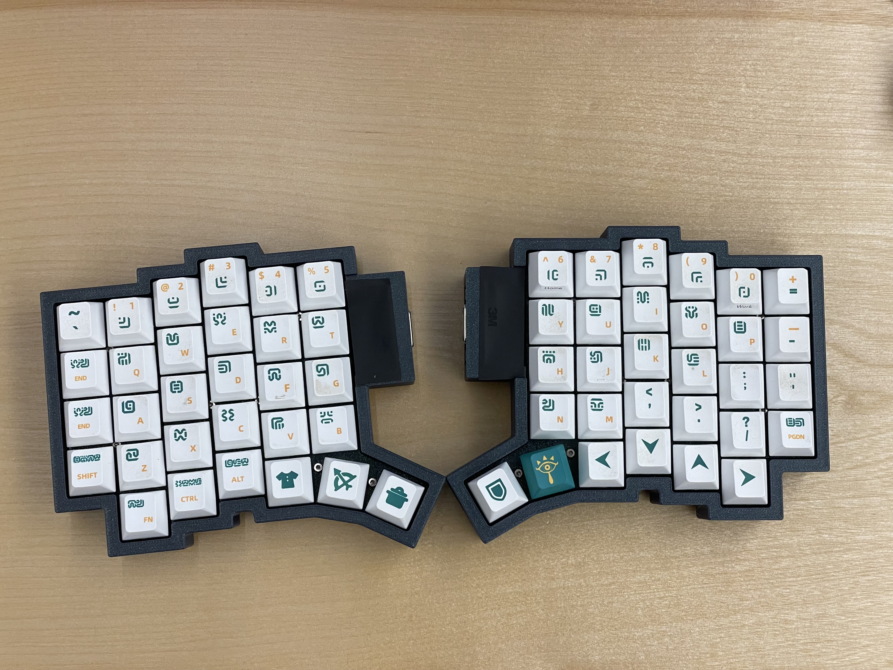

# SPKY
This is a series of split, ergonomics keyboard that I designed and built.

I've beed play with different combinations of hardware and software with each version.

## SPKYv1
This is a split, column stagger, wireless build with PCB plate.

The layout was heavily inspired from other split keyboards, like [dygma defy](https://dygma.com/pages/defy) and the [moonlander](https://www.zsa.io/moonlander).

## SPKYv2
This is a row stagger, wired keyboard. One with MX switch and another version with choc switch.
MX version:

Choc version:

## SPKYv3
This is a 3D printed, hand wired keyboard, with slightly altered layout from spkyv1.
